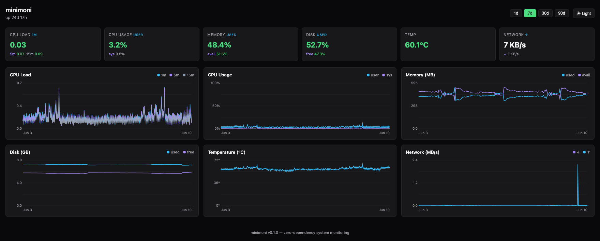
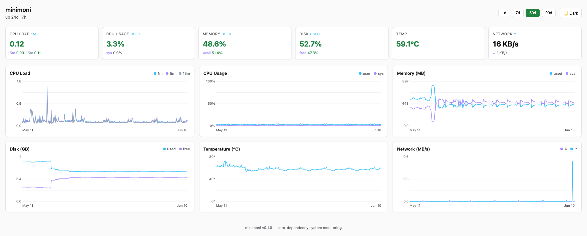

#  minimoni

Zero-dependency system monitoring in a single C binary. Collects CPU, memory, disk,
temperature, and network metrics into SQLite and serves an interactive canvas dashboard.

Designed for resource-constrained Linux systems (small VPS, single-board computers,
and homelab servers) where every MB counts.

- Single static binary (~1.2 MB), zero runtime dependencies, no package manager
- CPU load and usage, memory, disk, temperature, network throughput, and uptime
- Interactive canvas dashboard, dark/light theme, live updates via SSE
- SQLite storage with configurable retention
- Webhook and command alerts with per-alert cooldown
- TOML configuration, sensible defaults, works with zero config
- Runs comfortably on small arm64 boards (Raspberry Pi 3B, Zero 2 W, 512 MB RAM)



<details>
<summary>Light theme</summary>



</details>

## How it works

```
minimoni serve   -->  collect metrics  -->  SQLite  -->  HTTP server  -->  dashboard :8080
minimoni collect -->  collect metrics  -->  SQLite     (oneshot, for systemd timer / cron)
```

Metrics are read from `/proc/` and `/sys/`. The dashboard HTML is embedded in the binary
at build time, so there are no files to deploy alongside the binary.

## How minimoni compares

| | minimoni | [Beszel][b] | [Netdata][n] |
|---|---|---|---|
| RAM (daemon) | ~1.6 MB [1] | ~5-10 MB + ~75 MB hub | ~150-200 MB |
| Architecture | single binary | agent + hub | agent (complex) |
| Runtime deps | none | none | many |
| Dashboard | yes (canvas) | yes (web UI) | yes (web UI) |
| Persistent history | yes (SQLite) | yes (SQLite) | yes |
| Alerts | yes (webhook + cmd) | yes | yes |
| License | GPLv3+ | MIT | GPLv3+ / NCUL1 [2] |

[1] Measured on a Raspberry Pi 3B (Raspberry Pi OS, kernel 6.18, arm64): ~1.6 MB PSS at idle
and under sustained query load. The static musl build keeps a flat memory profile; it
self-trims under query pressure rather than accumulating, and never touches swap.  
[2] Netdata agent is GPLv3+; the v2 dashboard is under NCUL1, a proprietary licence.

RAM sources: Beszel - [HowToGeek (2026)][s1], [instapods (2026)][s2].  
Netdata - [official docs][s3], [instapods (2026)][s2].

[b]: https://github.com/henrygd/beszel
[n]: https://github.com/netdata/netdata
[s1]: https://www.howtogeek.com/the-server-monitor-i-run-on-everything-is-5mb-and-tracks-every-metric-i-need/
[s2]: https://instapods.com/apps/beszel/vs/netdata/
[s3]: https://learn.netdata.cloud/docs/netdata-agent/resource-utilization/ram

## Performance

Measured on a Raspberry Pi 3B (Cortex-A53, 1 GB RAM, Raspberry Pi OS, kernel 6.18, arm64)
with the CI-built static musl binary (`-Os -flto`), against a continuous ~50-day database
(~72k rows at a 1-minute interval):

| Metric | Value |
|---|---:|
| Binary size | 1.24 MB |
| PSS (idle and under query load) | ~1.6 MB, flat |
| CPU per collect cycle | ~11 ms (excl. the 250 ms intentional sleep for the CPU delta) |
| Disk writes per 1-min cycle | 24 KiB (SQLite WAL) |
| `/api/metrics?range=1d` | ~100 ms |
| `/api/metrics?range=7d` | ~460 ms |
| `/api/metrics?range=30d` | ~1.7 s |
| `/api/metrics?range=90d` | ~3.0 s |
| `/api/current`, `/api/health` | ~2 ms, ~1 ms |

PSS does not grow under query load; the daemon self-trims rather than accumulating, and
Swap stays at 0 throughout. Long-range query time scales with the number of rows in range.

## Installation

### Prebuilt binary

Prebuilt static binaries for `linux-amd64` and `linux-arm64` are available on the
[releases page](https://github.com/javierbeaumont/minimoni/releases).

```sh
ARCH=$(uname -m)
case $ARCH in x86_64) ARCH=amd64 ;; aarch64) ARCH=arm64 ;; esac
BASE=https://github.com/javierbeaumont/minimoni/releases/latest/download
curl -fsSL $BASE/minimoni-linux-$ARCH -o /usr/local/bin/minimoni
chmod +x /usr/local/bin/minimoni
```

Supported platforms: `linux-amd64` (x86\_64), `linux-arm64` (Raspberry Pi 3/4/5 and other
64-bit AArch64 boards). A 64-bit OS is required; 32-bit (armv7) builds are not provided.

## Building

### Prerequisites

```sh
# Debian / Ubuntu / Raspberry Pi OS
sudo apt-get install gcc make xxd git

# Alpine (already included in the make release-linux Docker image)
apk add gcc musl-dev make xxd git

# Fedora / RHEL
sudo dnf install gcc make vim-common git # xxd is in vim-common

# Arch
sudo pacman -S gcc make vim git
```

### Build

```sh
make embed   # bundle dashboard into build/embed.h (once, or after editing the dashboard)
make         # compile with -O2 (development)
make release # compile with -Os -flto, strip, matches the prebuilt binaries
```

`build/embed.h` is generated by `xxd -i` and is not tracked in git; run `make embed` before
your first build or after editing any file under `dashboard/`.

To produce a release binary identical to the prebuilt ones (Alpine musl, static):

```sh
make release-linux # builds inside an Alpine Docker container
```

## Running

```sh
minimoni serve     # start HTTP server + background collector
minimoni collect   # collect once and exit (for systemd timer or cron)
minimoni --version
minimoni --help    # usage summary (also -h)
```

`serve` binds to `0.0.0.0:8080` by default. Open `http://<host>:8080` in a browser.

To use a config file:

```sh
minimoni serve --config /etc/minimoni/config.toml
```

## HTTP endpoints

| Endpoint | Response | Purpose |
|---|---|---|
| `GET /` | Embedded HTML dashboard | Browser |
| `GET /api/current` | JSON: latest collected values + config | Snapshot |
| `GET /api/metrics?range=1d` | JSON: metric history grouped into ~`points` time buckets | Charts |
| `GET /api/health` | `{"status":"ok","version":"..."}` | Liveness probe |
| `GET /stream` | SSE: live push every `refresh` seconds | Live updates |

`range` accepts values from `[dashboard].ranges` (default `1d`, `7d`, `30d`, `90d`).

## Systemd setup

### Daemon mode

Create `/etc/systemd/system/minimoni.service`:

```ini
[Unit]
Description=minimoni system monitor
After=network.target

[Service]
Type=exec
ExecStart=/usr/local/bin/minimoni serve
DynamicUser=yes
Restart=on-failure
RestartSec=5
StateDirectory=minimoni

# Hardening: defence in depth on top of DynamicUser.
LockPersonality=true
MemoryDenyWriteExecute=true
NoNewPrivileges=true
PrivateDevices=true
PrivateTmp=true
ProtectClock=true
ProtectControlGroups=true
ProtectHome=true
ProtectHostname=true
ProtectKernelLogs=true
ProtectKernelModules=true
ProtectKernelTunables=true
ProtectProc=invisible
ProtectSystem=strict
RestrictAddressFamilies=AF_UNIX AF_INET AF_INET6
RestrictNamespaces=true
RestrictRealtime=true
RestrictSUIDSGID=true
SystemCallArchitectures=native
SystemCallFilter=@system-service

[Install]
WantedBy=multi-user.target
```

```sh
systemctl daemon-reload
systemctl enable --now minimoni
```

`DynamicUser=yes` runs minimoni as an unprivileged user. `StateDirectory=minimoni` creates
`/var/lib/minimoni/` automatically; set `collect.db = "/var/lib/minimoni/metrics.db"`.

### Oneshot mode (timer)

For scheduled collection without a persistent process:

```ini
# /etc/systemd/system/minimoni-collect.timer
[Unit]
Description=Collect system metrics every minute

[Timer]
OnCalendar=*:0/1
Persistent=true

[Install]
WantedBy=timers.target
```

```ini
# /etc/systemd/system/minimoni-collect.service
[Unit]
Description=minimoni metric collection

[Service]
Type=oneshot
ExecStart=/usr/local/bin/minimoni collect
DynamicUser=yes
StateDirectory=minimoni
```

```sh
systemctl daemon-reload
systemctl enable --now minimoni-collect.timer
```

## Configuration

minimoni works with zero config. To customize, create `config.toml` in the working directory
(or pass `--config /path/to/config.toml`). Search order: `--config` flag -> `./config.toml` ->
`/etc/minimoni/config.toml` -> built-in defaults.

### Collection

```toml
[collect]
db        = "/var/lib/minimoni/metrics.db"
interval  = 60
disk_path = "/"
```

**`db`**: path to the SQLite database. Default: `./metrics.db`. For a persistent installation,
use `/var/lib/minimoni/metrics.db` (create the directory first).

**`interval`**: how often to collect, in seconds (integer). Range: `1` to `3600`. Default: `60`.
Values below 1 abort with an error; values above 3600 emit a warning and clamp to 3600.
Lower intervals give finer granularity; higher intervals reduce database growth:

| Interval (s) | 90-day database |
|--------------|-----------------|
| `30`         | ~75 MB          |
| `60`         | ~25 MB          |
| `300`        | ~5 MB           |

**`disk_path`**: filesystem path passed to `statvfs()`. Default: `/`. To monitor a volume
mounted at `/data`, set `disk_path = "/data"`.

### Server

```toml
[server]
listen         = "0.0.0.0:8080"
threads        = 8
sse_keepalive  = 1
```

**`listen`**: address and port to bind. Use `0.0.0.0:8080` to accept from any interface, or
`127.0.0.1:8080` to restrict to localhost (e.g. when running minimoni behind a reverse proxy).

**`threads`**: number of HTTP worker threads. Each open dashboard tab holds one thread for its
SSE connection. Default `8` handles up to 8 simultaneous users; raise if you have more. Values
below `2` are rejected with an error (the SSE connection would occupy the only thread, making the
server non-functional). Values above `256` fall back to the default with a warning. Range: 2-256.

**`sse_keepalive`**: how often (in seconds) a keepalive comment is sent over each SSE connection
between data pushes. Allows the server to detect a closed browser tab and free its thread without
waiting up to `refresh` seconds. Default: `1`. Valid range: `1` to `refresh - 1`. If set to a
value outside this range, keepalive is inactive (logged as a warning at startup) and thread
recovery falls back to the next data push.

### Dashboard

```toml
[dashboard]
title        = "My Server" # browser tab and header (default: "minimoni")
theme        = "auto"      # "auto" | "light" | "dark"; "auto" follows OS preference
show_footer  = true        # show version footer (default: true)
refresh      = 30          # SSE push interval in seconds (default: 30)

ranges = ["1d", "7d", "30d", "90d"] # time range tabs; last value = retention
points = 300                        # target data points per chart (default: 300)

charts = ["cpu_load", "cpu_usage", "memory", "disk", "temp", "net"]
cards  = ["cpu_load", "cpu_usage", "memory", "disk", "temp", "net", "uptime"]

cpu_load_card_unit  = "abs"  # status card: "%" | "abs" (% = normalized by core count)
cpu_load_chart_unit = "abs"  # chart Y-axis: "%" | "abs"
memory_card_unit    = "%"    # status card: "%" | "mb" | "gb"
memory_chart_unit   = "mb"   # chart Y-axis: "%" | "mb" | "gb"
disk_card_unit      = "%"    # status card: "%" | "gb" | "tb"
disk_chart_unit     = "gb"   # chart Y-axis: "%" | "gb" | "tb"
temp_card_unit      = "c"    # status card: "%" | "c" | "f"
temp_chart_unit     = "c"    # chart Y-axis: "%" | "c" | "f"
# temp_max          = 95     # temperature mapped to 100% when temp_*_unit="%" (default: 85)
net_card_unit       = "mb"   # status card: "mb" | "gb" | "mbps" | "gbps"
net_chart_unit      = "mb"   # chart Y-axis: "mb" | "gb" | "mbps" | "gbps"
uptime_unit         = "auto" # uptime display: "auto" | "h" | "d"
```

All keys are optional. The values shown above are the defaults.

**`title`**: browser tab text, dashboard header, and the `hostname` field in webhook alert
payloads. If omitted, the dashboard shows "minimoni" and webhook payloads use the system
hostname from `gethostname()`. Set this when running multiple instances so alert notifications
identify the source host.

**`theme`**: when set to `"light"` or `"dark"`, the theme is fixed and the toggle button is
hidden. `"auto"` (default) follows the OS preference and shows the toggle.

**`charts`** and **`cards`** control visibility and order **in the dashboard UI**. When not set,
all metrics are shown in the default order. Set to `[]` to hide everything. Set to a list to
show only those metrics in the listed order, e.g. `charts = ["memory", "disk"]` shows only
those two charts, with Memory first. API endpoints always return all collected metrics; these
lists only control what the dashboard renders. Temperature is the exception (see below).

**Temperature visibility**: `temp` is special: it depends on hardware. Two rules apply:

- If `temp` is omitted from `charts` or `cards`, the sensor is not read and no temperature data
  is sent in API responses. This is the only metric where dashboard config affects the API.
- If `temp` is included (or the list is not set), but no sensor is present on the host, `null`
  is sent and the card/chart is hidden. A missing sensor never produces a visible empty card.

**`refresh`**: how often the dashboard receives a live data push over SSE, in seconds. Must not
exceed `collect.interval`: a push more frequent than collection would send stale data and waste
bandwidth. If `refresh` is set higher than `interval`, minimoni clamps it to `interval` and logs
a warning. Default: `30`.

**`ranges`**: time range tabs shown in the dashboard, in the listed order. The **last (largest)
value sets the retention period**: rows older than that are deleted after each collect cycle.
Units: `h` (hours) or `d` (days). Values shorter than `collect.interval` are silently ignored.
Repeats and custom ordering are valid (e.g. `["4h", "2d", "45d", "2d"]` shows four tabs in that
order with 45-day retention). Default: `["1d", "7d", "30d", "90d"]`.

**`points`**: target number of data points per chart. The server picks the nearest
human-readable bucket size (1m, 2m, 5m, 10m, 15m, 30m, 1h, 2h, 3h, 6h, 12h, 24h) that
returns approximately this many points. Ranges short enough to fit within `points` raw samples
are always served at full resolution. Default: `300`.

### Alerts

Alerts are evaluated after every collect cycle. Each `[[alert]]` block is independent.
An alert requires `webhook`, `command`, or both.

```toml
[[alert]]
name      = "disk-full"    # identifier shown in logs
metric    = "disk_percent" # see metric table below
operator  = ">"            # supported: > < >= <= ==
threshold = 90             # in the metric's own unit (see below)
webhook   = "https://ntfy.sh/my-server" # POST JSON to this URL on fire
command   = "/usr/local/bin/notify.sh"  # execute this command on fire
cooldown  = "1h"           # minimum time between repeated firings
```

**Available metrics:**

| Metric | Unit | Description |
|---|---|---|
| `load_1m` | load avg | 1-minute load average |
| `load_5m` | load avg | 5-minute load average |
| `load_15m` | load avg | 15-minute load average |
| `cpu_user_percent` | % | User-space CPU usage |
| `cpu_system_percent` | % | Kernel CPU usage |
| `cpu_idle_percent` | % | Idle CPU |
| `mem_total_mb` | MB | Total memory |
| `mem_used_mb` | MB | Used memory |
| `mem_available_mb` | MB | Available memory |
| `mem_percent` | % | Used memory as percent of total |
| `disk_total_gb` | GB | Total disk space |
| `disk_used_gb` | GB | Used disk space |
| `disk_free_gb` | GB | Free disk space |
| `disk_percent` | % | Used disk as percent of total |
| `temp_celsius` | C | CPU temperature (skipped if no sensor is present) |
| `net_rx_bps` | bytes/s | Receive throughput |
| `net_tx_bps` | bytes/s | Transmit throughput |
| `uptime_seconds` | s | Seconds since boot |

Thresholds are compared against the raw metric value, in the unit named by its suffix:
`_mb` is megabytes, `_gb` is gigabytes, `_percent` is a percentage, `_celsius` is degrees
Celsius, `_bps` is bytes per second. `load_*` are raw load averages; `uptime_seconds` is
in seconds. Dashboard unit settings do not affect alert thresholds; alerts read the
stored database values directly.

When `webhook` is set, minimoni sends a POST request (`Content-Type: application/json`).
**Requires outbound HTTP connectivity from the server.**

```json
{
    "alert":     "disk-full",
    "metric":    "disk_percent",
    "value":     91.3,
    "threshold": 90,
    "operator":  ">",
    "timestamp": "2026-06-08T14:30:00Z",
    "hostname":  "my-server"
}
```

When `command` is set, it is executed via `system()` with the same user and privileges
as the minimoni process. Keep commands short and non-blocking; long-running commands
delay the next collect cycle.

`cooldown` prevents repeated firings: the alert will not fire again until the cooldown
period has elapsed. Accepts `30s`, `1m`, `1h`, `1d`. Cooldown state is stored in the database
(`alert_log` table) and survives restarts.

### Public access

minimoni has no built-in authentication or TLS. **Do not expose it directly to the internet.**

The recommended setup is to bind minimoni to localhost and front it with a reverse proxy that
handles TLS and authentication:

```toml
# config.toml
[server]
listen = "127.0.0.1:8080"
```

**Caddy** (automatic HTTPS + basic auth):

```
monitor.example.com {
    basicauth {
        admin JDJhJDE0JHh4eHh4eHh4eHh4eHh4eHh4eHh4eA==
    }
    reverse_proxy localhost:8080
}
```

Caddy's `reverse_proxy` streams SSE without buffering by default; no additional
configuration needed.

**nginx**:

```nginx
server {
    listen 443 ssl;
    server_name monitor.example.com;

    auth_basic "minimoni";
    auth_basic_user_file /etc/nginx/.htpasswd;

    location / {
        proxy_pass http://127.0.0.1:8080;
        proxy_set_header Connection "";   # required for SSE
        proxy_buffering off;
    }
}
```

The `proxy_buffering off` directive is required for the SSE live-update stream to reach
the browser without being held in nginx's buffer.

### Example configurations

**Minimal (Raspberry Pi or homelab):**

```toml
[collect]
db = "/var/lib/minimoni/metrics.db"
```

Omitting all other keys uses: port 8080, 1-minute interval, `/` filesystem, 90-day retention.

**VPS bound to localhost (behind nginx or Caddy):**

```toml
[server]
listen = "127.0.0.1:8080"
```

**Multiple alerts (disk, CPU load, and temperature):**

```toml
[[alert]]
name      = "disk-full"
metric    = "disk_percent"
operator  = ">"
threshold = 85
webhook   = "https://ntfy.sh/my-server"
cooldown  = "6h"

[[alert]]
name      = "high-load"
metric    = "load_5m"
operator  = ">="
threshold = 4
webhook   = "https://ntfy.sh/my-server"
cooldown  = "30m"

[[alert]]
name      = "overheating"
metric    = "temp_celsius"
operator  = ">"
threshold = 80
command   = "/usr/local/bin/thermal-alert.sh"
cooldown  = "15m"
```

See `config.example.toml` for a fully annotated reference.

## Vendored dependencies

All four compile directly into the binary; no runtime dependencies, no package manager.

| Library | Version | Purpose | License |
|---|---|---|---|
| [SQLite](https://www.sqlite.org/) | 3.53.1 | Single-file metric database | Public domain |
| [civetweb](https://github.com/civetweb/civetweb) | 1.16 | Embedded HTTP server, JSON API | MIT |
| [tomlc17](https://github.com/cktan/tomlc17) | R260517 | TOML configuration parser | MIT |
| [BearSSL](https://bearssl.org/) | 0.6 | TLS client for HTTPS webhook delivery | MIT |

## Architecture Decision Records

Significant technology choices are documented as ADRs in [`docs/adr/`](docs/adr/). Each
record captures the context, the alternatives considered, the decision made, and its
consequences, so future contributors understand not just what was chosen but why.

| ADR | Decision |
|---|---|
| [0001](docs/adr/0001-sqlite.md) | SQLite as the metric store |
| [0002](docs/adr/0002-civetweb.md) | civetweb as the HTTP server |
| [0003](docs/adr/0003-tomlc17.md) | tomlc17 as the TOML parser |
| [0004](docs/adr/0004-bearssl.md) | BearSSL for HTTPS webhook delivery |

## Roadmap

**v0.2.0 (Eddystone)**: tiered write-time consolidation to flatten long-range
(30d / 90d) query latency.

## Contributing

Contributions are welcome. See [CONTRIBUTING.md](CONTRIBUTING.md) for build, style,
and commit conventions, and the [Code of Conduct](CODE_OF_CONDUCT.md).

To report a security issue privately, see [SECURITY.md](SECURITY.md) (please do not
open a public issue for vulnerabilities).

## License

GPL-3.0-or-later. See [LICENSE](LICENSE) for the full text.
