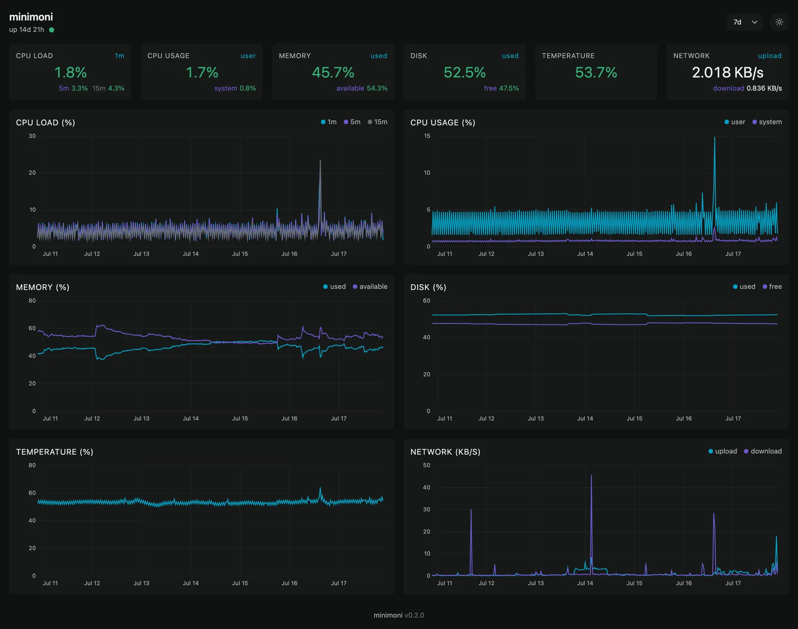
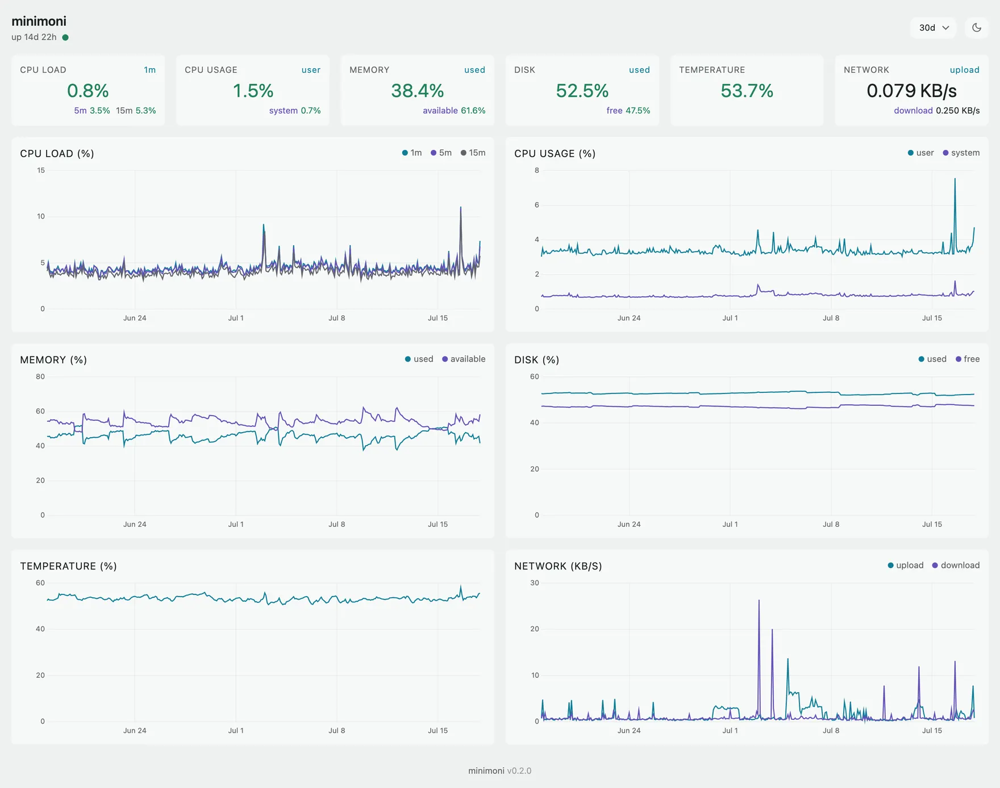

#  minimoni

![Dependencies: 0][b-deps]
![Binary ~1.2 MB][b-size]
[![Tests][b-tests]][w-tests]
[![Security analysis][b-sec]][w-sec]
[![Latest release][b-rel]][rel]
[![License: GPLv3][b-lic]][lic]

Zero-dependency system monitoring in a single C binary. Collects CPU, memory, disk,
temperature, and network metrics into SQLite and serves an interactive canvas dashboard.

Try the [live demo][demo]: a Raspberry Pi 3B monitoring itself.

Designed for resource-constrained Linux systems (small VPS, single-board computers,
and homelab servers) where every MB counts.

- Single static binary (~1.2 MB), zero runtime dependencies, no package manager
- CPU load and usage, memory, disk, temperature, network throughput, and uptime
- Interactive canvas dashboard, responsive, accessible, dark/light theme, live updates via SSE
- SQLite storage with configurable retention
- Webhook and command alerts with per-alert cooldown
- TOML configuration, sensible defaults, works with zero config
- Runs comfortably on small arm64 boards (a Raspberry Pi 3B, or a 512 MB Pi Zero 2 W); 32-bit
  ARMv7 and ARMv6 binaries are published too, down to the original Pi Zero



<details>
<summary>Light theme</summary>



</details>

## How it works

```
minimoni serve   -->  collect metrics  -->  SQLite  -->  HTTP server  -->  dashboard :8080
minimoni collect -->  collect metrics  -->  SQLite     (oneshot, for systemd timer / cron)
```

Metrics are read from `/proc/` and `/sys/`. The dashboard HTML is embedded in the binary
at build time, so there are no files to deploy alongside the binary.

## How minimoni compares

|                    | minimoni            | [Beszel][b]           | [Netdata][n]       |
|--------------------|---------------------|-----------------------|--------------------|
| RAM (daemon)       | ~1.7 MB [1]         | ~5-10 MB + ~75 MB hub | ~150-200 MB        |
| Architecture       | single binary       | agent + hub           | agent (complex)    |
| Runtime deps       | none                | none                  | many               |
| Dashboard          | yes (canvas)        | yes (web UI)          | yes (web UI)       |
| Persistent history | yes (SQLite)        | yes (SQLite)          | yes                |
| Alerts             | yes (webhook + cmd) | yes                   | yes                |
| License            | GPLv3+              | MIT                   | GPLv3+ / NCUL1 [2] |

[1] Measured on a Raspberry Pi 3B (Raspberry Pi OS, kernel 6.18, arm64): ~1.7 MB PSS, with little
difference between an idle daemon and one serving queries. The static musl build never touches
swap.
[2] Netdata agent is GPLv3+; the v2 dashboard is under NCUL1, a proprietary licence.

RAM sources. Beszel: [HowToGeek (2026)][s1], [instapods (2026)][s2].
Netdata: [official docs][s3], [instapods (2026)][s2].

[b]: https://github.com/henrygd/beszel
[n]: https://github.com/netdata/netdata
[s1]: https://www.howtogeek.com/the-server-monitor-i-run-on-everything-is-5mb-and-tracks-every-metric-i-need/
[s2]: https://instapods.com/apps/beszel/vs/netdata/
[s3]: https://learn.netdata.cloud/docs/netdata-agent/resource-utilization/ram

## Performance

Measured on a Raspberry Pi 3B (Cortex-A53, 1 GB RAM, Raspberry Pi OS, kernel 6.18, arm64) with the
static musl binary (`-Os -flto`), against a copy of a live production database (23 769 rows over
90 days, 23 MB), after letting the daemon settle for two hours:

| Metric                          |                                                         Value |
|---------------------------------|--------------------------------------------------------------:|
| Binary size                     |                                                       1.23 MB |
| PSS (idle and under query load) |                             ~1.7 MB, little change under load |
| CPU per collect cycle           | ~15 ms (excl. the 250 ms intentional sleep for the CPU delta) |
| Disk writes per 1-min cycle     |                                          ~30 KiB (SQLite WAL) |
| `/api/metrics?range=1d`         |                                                        ~60 ms |
| `/api/metrics?range=7d`         |                                                       ~155 ms |
| `/api/metrics?range=30d`        |                                                       ~285 ms |
| `/api/metrics?range=90d`        |                                                       ~450 ms |
| `/api/current`, `/api/health`   |                                                  ~2 ms, ~1 ms |

Serving queries barely moves PSS, and repeated bursts do not move it further; Swap stays at 0
throughout. Disk writes track the database's own maintenance rather than the traffic served: the
WAL checkpoints about every five hours, which amortises to roughly 1 KiB per cycle on top of the
baseline above. Tiered write-time consolidation keeps 30d and 90d queries flat in the hundreds of
ms rather than scaling with the row count.

## Installation

### Prebuilt binary

Prebuilt static binaries for `linux-amd64`, `linux-arm64`, `linux-armv7`, and `linux-armv6`
are available on the [releases page](https://github.com/javierbeaumont/minimoni/releases).

```sh
ARCH=$(uname -m)
case $ARCH in
  x86_64)  ARCH=amd64 ;;
  aarch64) ARCH=arm64 ;;
  armv7l)  ARCH=armv7 ;;
  armv6l)  ARCH=armv6 ;;
esac

BASE=https://github.com/javierbeaumont/minimoni/releases/latest/download
curl -fsSL $BASE/minimoni-linux-$ARCH -o /usr/local/bin/minimoni
chmod +x /usr/local/bin/minimoni
```

Supported platforms (all static musl, no runtime dependencies): `linux-amd64` (x86\_64),
`linux-arm64` (Raspberry Pi 3/4/5 and other 64-bit AArch64 boards), `linux-armv7` (32-bit
ARMv7, e.g. a Pi 2 or a Pi 3/4 on a 32-bit OS), and `linux-armv6` (ARMv6: Raspberry Pi 1
and the original Pi Zero / Zero W). The armv6 build is published for completeness but has
not been tested on real ARMv6 hardware.

The release binaries carry SLSA build provenance (SLSA Build Level 2): each is built on
GitHub-hosted runners with a signed, verifiable attestation. Verifying a download is
optional; to check the binary you installed:

```sh
gh attestation verify /usr/local/bin/minimoni --repo javierbeaumont/minimoni
```

Every release also ships a `checksums.txt` manifest. Without `gh`, check your binary
against the line for your architecture (`sha256sum` reports `OK` or `FAILED`):

```sh
curl -fsSL $BASE/checksums.txt -o checksums.txt
grep " minimoni-linux-$ARCH$" checksums.txt \
  | sed "s|minimoni-linux-$ARCH|/usr/local/bin/minimoni|" \
  | sha256sum -c
```

Releases are immutable (assets and the tag are locked once published), and each ships a
CycloneDX SBOM (`sbom.cdx.json`) listing the vendored dependencies compiled into the binary.

## Building

### Prerequisites

```sh
# Debian / Ubuntu / Raspberry Pi OS
sudo apt-get install gcc make xxd git

# Alpine (already included in the make release-linux Docker image)
apk add gcc musl-dev make xxd git

# Fedora / RHEL
sudo dnf install gcc make vim-common git # xxd is in vim-common

# Arch
sudo pacman -S gcc make vim git
```

### Build

```sh
make embed   # bundle dashboard into build/embed.h (once, or after editing the dashboard)
make         # compile with -O2 (development)
make release # compile with -Os -flto, strip, matches the prebuilt binaries
```

`build/embed.h` is generated by `xxd -i` and is not tracked in git; run `make embed` before
your first build or after editing any file under `dashboard/`.

To produce a release binary identical to the prebuilt ones (Alpine musl, static):

```sh
make release-linux # builds inside an Alpine Docker container
```

## Running

```sh
minimoni serve             # start HTTP server + background collector
minimoni collect           # collect once and exit (for systemd timer or cron)
minimoni db info <db_path> # inspect a database file (read-only)
minimoni --version
minimoni --help            # usage summary (also -h)
```

`serve` binds to `0.0.0.0:8080` by default. Open `http://<host>:8080` in a browser.

To use a config file:

```sh
minimoni serve --config /etc/minimoni/config.toml
```

`db info` takes the path to a database file (not the config file) and prints a
read-only report: the file size (plus any WAL/SHM sidecars), the format
identifier (minimoni's schema version, or a hex id when the file is not a
minimoni database), the row count with the oldest and newest timestamps and the
time span they cover, the per-tier row distribution (or a note when the database
uses an older schema without tiered consolidation), and a summary of the alert
log. It opens the file read-only, so it is safe to run against the database of a
live daemon.

## Upgrading

minimoni versions the database schema (`PRAGMA user_version`). When you move to
a release that changes it (e.g. v0.1 to v0.2, which adds tiered consolidation),
the daemon refuses to start against the old database rather than corrupt it.
Migrate it first with `minimoni-migrate`, published alongside `minimoni` on the
[releases page][rel] (one build per architecture). Download the one matching your system:

```sh
ARCH=$(uname -m)
case $ARCH in
  x86_64)  ARCH=amd64 ;;
  aarch64) ARCH=arm64 ;;
  armv7l)  ARCH=armv7 ;;
  armv6l)  ARCH=armv6 ;;
esac

BASE=https://github.com/javierbeaumont/minimoni/releases/latest/download
curl -fsSL $BASE/minimoni-migrate-linux-$ARCH -o /usr/local/bin/minimoni-migrate
chmod +x /usr/local/bin/minimoni-migrate
```

Then stop the service, migrate, and start it again:

```sh
sudo systemctl stop minimoni
minimoni-migrate --dry-run /var/lib/minimoni/metrics.db   # rehearse, no changes
minimoni-migrate /var/lib/minimoni/metrics.db             # migrate (auto-backup)
sudo systemctl start minimoni
```

`--dry-run` prints `status: up-to-date | migration-pending | blocked` and changes
nothing, so a deploy can verify the upgrade will apply before swapping the binary.
A real run snapshots to `<db>.backup-pre-migrate-vN` first (opt out: `--no-backup`).

If migrate refuses with a schema-fingerprint mismatch, the database structure
diverges from the canonical schema (e.g. a hand-added column or a different
type). Review the reported diff, then either re-run with `--force` to accept the
divergence (a backup is still taken), or restore the canonical schema by hand:
inside a transaction, rename the table aside, recreate it with the canonical
`CREATE TABLE` text, copy the rows back with an explicit column list, drop the
old table, recreate the indexes, and commit. Re-run migrate afterwards; all rows
are preserved.

## HTTP endpoints

| Endpoint           | Response                                     | Purpose        |
|--------------------|----------------------------------------------|----------------|
| `GET /`            | Embedded HTML dashboard                      | Browser        |
| `GET /api/current` | JSON: latest collected values + config       | Snapshot       |
| `GET /api/metrics` | JSON: history grouped into ~`points` buckets | Charts         |
| `GET /api/health`  | `{"status":"ok","version":"..."}`            | Liveness probe |
| `GET /stream`      | SSE: live push every `refresh` seconds       | Live updates   |

`/api/metrics` takes two query parameters, e.g. `GET /api/metrics?range=1d&points=480`:

- **`range`**: one of `[dashboard].ranges` (default `1d`, `7d`, `30d`, `90d`).
- **`points`**: optional; how many buckets to group the history into. The server caps it
  at `1440` (one point per minute over a 24h window, the design point of the tiered
  consolidation ladder; see [ADR-0005](docs/adr/0005-tiered-consolidation.md)) and
  defaults to `240` when omitted. The bundled dashboard computes it from the canvas
  width (1 point per 4 backing pixels, clamped to `[120, 1440]`).

## Systemd setup

Ready-to-use unit files are in [`contrib/systemd/`](contrib/systemd/). Both services run
under `DynamicUser=yes` with a strict sandbox (LockPersonality, MemoryDenyWriteExecute,
NoNewPrivileges, ProtectSystem strict, restricted syscall filter, etc.); see the files for
the full list.

### Daemon mode

```sh
sudo cp contrib/systemd/minimoni.service /etc/systemd/system/
sudo systemctl daemon-reload
sudo systemctl enable --now minimoni
```

`StateDirectory=minimoni` creates `/var/lib/minimoni/` automatically; set
`collect.db = "/var/lib/minimoni/metrics.db"` in your config.

### Oneshot mode (timer)

For scheduled collection without a persistent process:

```sh
sudo cp contrib/systemd/minimoni-collect.service /etc/systemd/system/
sudo cp contrib/systemd/minimoni-collect.timer   /etc/systemd/system/
sudo systemctl daemon-reload
sudo systemctl enable --now minimoni-collect.timer
```

The timer fires every minute (`OnCalendar=*:0/1`) and runs the oneshot service. Adjust the
cadence by editing the `.timer` file.

When upgrading to a release that changes the database schema, stop the service and run
`minimoni-migrate` before starting it again; the daemon refuses to start against an
unmigrated database. See [Upgrading](#upgrading).

## Configuration

minimoni works with zero config. To customize, create `config.toml` in the working directory
(or pass `--config /path/to/config.toml`). Search order: `--config` flag -> `./config.toml` ->
`/etc/minimoni/config.toml` -> built-in defaults.

### Collection

```toml
[collect]
db        = "/var/lib/minimoni/metrics.db"
interval  = 60
disk_path = "/"
```

**`db`**: path to the SQLite database. Default: `./metrics.db`. For a persistent installation,
use `/var/lib/minimoni/metrics.db` (create the directory first).

**`interval`**: how often to collect, in seconds (integer). Range: `1` to `3600`. Default: `60`.
Values below 1 abort with an error; values above 3600 emit a warning and clamp to 3600.
Lower intervals give finer granularity; higher intervals reduce database growth:

| Interval (s) | 90-day database |
|--------------|-----------------|
| `30`         | ~75 MB          |
| `60`         | ~25 MB          |
| `300`        | ~5 MB           |

**`disk_path`**: filesystem path passed to `statvfs()`. Default: `/`. To monitor a volume
mounted at `/data`, set `disk_path = "/data"`.

### Server

```toml
[server]
listen         = "0.0.0.0:8080"
max_dashboards = 4
sse_keepalive  = 1
```

**`listen`**: address and port to bind. Use `0.0.0.0:8080` to accept from any interface, or
`127.0.0.1:8080` to restrict to localhost (e.g. when running minimoni behind a reverse proxy).

**`max_dashboards`**: how many dashboards may receive live updates at the same time. Each open
tab holds one server-sent-events connection for as long as it stays open, so this is the number
that matters in practice. Beyond it, `/stream` answers `503 Service Unavailable`: that tab still
loads the page and keeps retrying, it just does not update live, and every other route keeps
answering normally. Raising it costs memory in proportion: each extra dashboard adds a worker
thread, measured on a Pi 3B at ~13 kB idle and ~38 kB while queries are being served. Values below
`1` are rejected with an error. Values above `256` fall back to the default with a warning.
Range: 1-256.

**`sse_keepalive`**: how often (in seconds) a keepalive comment is sent over each SSE connection
between data pushes. Allows the server to detect a closed browser tab and free its thread without
waiting up to `refresh` seconds. Default: `1`. Valid range: `1` to `refresh - 1`. If set to a
value outside this range, keepalive is inactive (logged as a warning at startup) and thread
recovery falls back to the next data push.

### Dashboard

```toml
[dashboard]
title        = "My Server" # browser tab and header (default: "minimoni")
theme        = "auto"      # "auto" | "light" | "dark"; "auto" follows OS preference
show_footer  = true        # show version footer (default: true)
refresh      = 30          # SSE push interval in seconds (default: 30)

ranges = ["1d", "7d", "30d", "90d"] # time range tabs; largest sets retention

charts = ["cpu_load", "cpu_usage", "memory", "disk", "temp", "net"]
cards  = ["cpu_load", "cpu_usage", "memory", "disk", "temp", "net", "uptime"]

cpu_load_card_unit     = "abs"  # status card: "%" | "abs" (% = normalized by core count)
cpu_load_chart_unit    = "abs"  # chart Y-axis: "%" | "abs"
memory_card_unit       = "%"    # status card: "%" | "auto"
memory_chart_unit      = "auto" # chart Y-axis: "%" | "auto"
disk_card_unit         = "%"    # status card: "%" | "auto"
disk_chart_unit        = "auto" # chart Y-axis: "%" | "auto"
temp_card_unit         = "c"    # status card: "%" | "c" | "f"
temp_chart_unit        = "c"    # chart Y-axis: "%" | "c" | "f"
# temp_critical_fallback = 95     # temp % 100% ref when sysfs has no critical trip (default: 85)
net_card_unit          = "bytes" # status card: "%" | "bytes" | "bits"
net_chart_unit         = "bytes" # chart Y-axis: "%" | "bytes" | "bits"
# net_max_speed          = 300    # link ceiling in Mbit/s: the net "%" denominator and the
#                                 # source of its thresholds. Wins over the sysfs link speed
#                                 # (the NIC's, not your uplink). Unset: sysfs, else 1000
uptime_unit            = "auto" # uptime display: "auto" | "h" | "d"
```

All keys are optional. The values above are the defaults, with three exceptions: `title` defaults
to `minimoni`, and `charts` and `cards` are unset by default, which shows every metric in the
order listed above.

**`title`**: browser tab text, dashboard header, and the `hostname` field in webhook alert
payloads. If omitted, the dashboard shows "minimoni" and webhook payloads use the system
hostname from `gethostname()`. Set this when running multiple instances so alert notifications
identify the source host.

**`theme`**: when set to `"light"` or `"dark"`, the theme is fixed and the toggle button is
hidden. `"auto"` (default) follows the OS preference and shows the toggle.

**`charts`** and **`cards`** control visibility and order **in the dashboard UI**. When not set,
all metrics are shown in the default order. Set to `[]` to hide everything. Set to a list to
show only those metrics in the listed order, e.g. `charts = ["memory", "disk"]` shows only
those two charts, with Memory first. API endpoints always return all collected metrics; these
lists only control what the dashboard renders. Temperature is the exception (see below).

**Temperature visibility**: `temp` is special: it depends on hardware. Two rules apply:

- If `temp` is omitted from `charts` or `cards`, the sensor is not read and no temperature data
  is sent in API responses. This is the only metric where dashboard config affects the API.
- If `temp` is included (or the list is not set), but no sensor is present on the host, `null`
  is sent and the card/chart is hidden. A missing sensor never produces a visible empty card.

**`refresh`**: how often the dashboard receives a live data push over SSE, in seconds. Must not
exceed `collect.interval`: a push more frequent than collection would send stale data and waste
bandwidth. If `refresh` is set higher than `interval`, minimoni clamps it to `interval` and logs
a warning. Default: `30`.

**`ranges`**: time range tabs shown in the dashboard, in the listed order. The **largest value
sets the retention period** (regardless of position): rows older than that are deleted after
each collect cycle. Units and per-unit caps: `m` (max 120), `h` (max 72), `d` (max 10 years).
Values shorter than `collect.interval` are skipped with a warning; if every value is invalid
or skipped, the daemon aborts at config load (instead of silently falling back to defaults).
Repeats and custom ordering are valid (e.g. `["4h", "2d", "45d", "2d"]` shows four tabs in
that order with 45-day retention). Sub-day ranges round up to 1 day for retention purposes
(prune granularity is days). Default: `["1d", "7d", "30d", "90d"]`.

**`memory_card_unit`** / **`memory_chart_unit`** / **`disk_card_unit`** / **`disk_chart_unit`**:
`"%"` shows the share of capacity in use; `"auto"` shows the amount itself. The two keys are
independent, so a percentage card next to an absolute chart is a valid combination. Under `"auto"`
the magnitude is not configurable, see **Automatic magnitudes** below.

**`net_card_unit`** / **`net_chart_unit`**: `"%"` measures throughput against the link ceiling (see
`net_max_speed`); `"bytes"` counts in KB/s, MB/s and GB/s, and `"bits"` in Kbps, Mbps and Gbps, the
form link speeds are usually quoted in. Bytes climb in steps of 1024, bits in steps of 1000, as each
convention has it. As with memory and disk, the magnitude itself is automatic.

**`temp_card_unit`** / **`temp_chart_unit`**: `"c"` for Celsius, `"f"` for Fahrenheit, or `"%"` of
the critical trip point the kernel reports for the sensor, falling back to
`temp_critical_fallback` when it reports none.

**Automatic magnitudes.** Under `"auto"`, `"bytes"` or `"bits"` you choose what is measured, never
the magnitude: the server picks that from the largest value in the window on screen, and a card and
its chart always read in the same one. It takes the smallest unit whose reading still fits the five
integer digits a card can display, so numbers stay whole (`1748 MB`, not `1.707 GB`), and it steps
up an order of magnitude early so a value arriving after the choice still fits. With nothing on
screen there is nothing to infer a unit from, and none is shown. Explicit magnitudes (`"mb"`,
`"gb"`, `"tb"`, `"kbps"`...) are not accepted: they warn at startup and fall back to the default.

**`net_max_speed`**: the link ceiling in Mbit/s. Denominator of the net `"%"` units and anchor of
the semaphore: yellow at 85% of it, red at 98%, both levels drawn on the chart once traffic
reaches them. Set your real ceiling, because sysfs reports the NIC and not the uplink behind it:
a 1 GbE card on a 300 Mbit line reads 1000, and every value then looks three times healthier than
it is. With neither this key nor sysfs, minimoni assumes 1 GbE.

The number of data points per chart is no longer a per-install setting: the dashboard
JS asks for what it can render, via the `points` query parameter on `/api/metrics`
(see [HTTP endpoints](#http-endpoints)). The server caps it at `1440`: one point per
minute over a 24h window, which is also the design point of the tiered consolidation
ladder (see [ADR-0005](docs/adr/0005-tiered-consolidation.md)), and defaults to `240`
if the parameter is missing.

### Alerts

Alerts are evaluated after every collect cycle. Each `[[alert]]` block is independent.
An alert requires `webhook`, `command`, or both.

```toml
[[alert]]
name      = "disk-full"    # identifier shown in logs
metric    = "disk_percent" # see metric table below
operator  = ">"            # supported: > < >= <= ==
threshold = 90             # in the metric's own unit (see below)
webhook   = "https://ntfy.sh/my-server" # POST JSON to this URL on fire
command   = "/usr/local/bin/notify.sh"  # execute this command on fire
cooldown  = "1h"           # minimum time between repeated firings
```

**Available metrics:**

| Metric               | Unit     | Description                                       |
|----------------------|----------|---------------------------------------------------|
| `load_1m`            | load avg | 1-minute load average                             |
| `load_5m`            | load avg | 5-minute load average                             |
| `load_15m`           | load avg | 15-minute load average                            |
| `cpu_user_percent`   | %        | User-space CPU usage                              |
| `cpu_system_percent` | %        | Kernel CPU usage                                  |
| `cpu_idle_percent`   | %        | Idle CPU                                          |
| `mem_total_mb`       | MB       | Total memory                                      |
| `mem_used_mb`        | MB       | Used memory                                       |
| `mem_available_mb`   | MB       | Available memory                                  |
| `mem_percent`        | %        | Used memory as percent of total                   |
| `disk_total_gb`      | GB       | Total disk space                                  |
| `disk_used_gb`       | GB       | Used disk space                                   |
| `disk_free_gb`       | GB       | Free disk space                                   |
| `disk_percent`       | %        | Used disk as percent of total                     |
| `temp_celsius`       | C        | CPU temperature (skipped if no sensor is present) |
| `net_rx_bps`         | bytes/s  | Receive throughput                                |
| `net_tx_bps`         | bytes/s  | Transmit throughput                               |
| `uptime_seconds`     | s        | Seconds since boot                                |

Thresholds are compared against the raw metric value, in the unit named by its suffix:
`_mb` is megabytes, `_gb` is gigabytes, `_percent` is a percentage, `_celsius` is degrees
Celsius, `_bps` is bytes per second. `load_*` are raw load averages; `uptime_seconds` is
in seconds. Dashboard unit settings do not affect alert thresholds; alerts read the
stored database values directly.

When `webhook` is set, minimoni sends a POST request (`Content-Type: application/json`).
**Requires outbound HTTP connectivity from the server.**

```json
{
    "alert":     "disk-full",
    "metric":    "disk_percent",
    "value":     91.3,
    "threshold": 90,
    "operator":  ">",
    "timestamp": "2026-06-08T14:30:00Z",
    "hostname":  "my-server"
}
```

When `command` is set, it is executed via `system()` with the same user and privileges
as the minimoni process. Keep commands short and non-blocking; long-running commands
delay the next collect cycle.

`cooldown` prevents repeated firings: the alert will not fire again until the cooldown
period has elapsed. Accepts `30s`, `1m`, `1h`, `1d`. Cooldown state is stored in the database
(`alert_log` table) and survives restarts.

### Public access

minimoni has no built-in authentication or TLS. **Do not expose it directly to the internet.**

The recommended setup is to bind minimoni to localhost and front it with a reverse proxy that
handles TLS and authentication:

```toml
# config.toml
[server]
listen = "127.0.0.1:8080"
```

Working configurations for **Caddy, nginx, Tailscale, Traefik, and Apache** are in
[`docs/reverse-proxy.md`](docs/reverse-proxy.md), including the per-proxy gotcha for
streaming the SSE live-update endpoint without buffering.

### Example configurations

**Minimal (Raspberry Pi or homelab):**

```toml
[collect]
db = "/var/lib/minimoni/metrics.db"
```

Omitting all other keys uses: port 8080, 1-minute interval, `/` filesystem, 90-day retention.

**VPS bound to localhost (behind nginx or Caddy):**

```toml
[server]
listen = "127.0.0.1:8080"
```

**Multiple alerts (disk, CPU load, and temperature):**

```toml
[[alert]]
name      = "disk-full"
metric    = "disk_percent"
operator  = ">"
threshold = 85
webhook   = "https://ntfy.sh/my-server"
cooldown  = "6h"

[[alert]]
name      = "high-load"
metric    = "load_5m"
operator  = ">="
threshold = 4
webhook   = "https://ntfy.sh/my-server"
cooldown  = "30m"

[[alert]]
name      = "overheating"
metric    = "temp_celsius"
operator  = ">"
threshold = 80
command   = "/usr/local/bin/thermal-alert.sh"
cooldown  = "15m"
```

See `config.example.toml` for a fully annotated reference.

## Vendored dependencies

All four compile directly into the binary; no runtime dependencies, no package manager.

| Library              | Version | Purpose                                 | License       |
|----------------------|---------|-----------------------------------------|---------------|
| [SQLite][SQLite]     | 3.53.3  | Single-file metric database             | Public domain |
| [civetweb][civetweb] | 1.16    | Embedded HTTP server, JSON API          | MIT           |
| [tomlc17][tomlc17]   | R260618 | TOML configuration parser               | MIT           |
| [BearSSL][BearSSL]   | 0.6     | TLS client for HTTPS webhook delivery   | MIT           |

[SQLite]: https://www.sqlite.org/
[civetweb]: https://github.com/civetweb/civetweb
[tomlc17]: https://github.com/cktan/tomlc17
[BearSSL]: https://bearssl.org/

## Architecture Decision Records

Significant technology choices are documented as ADRs in [`docs/adr/`](docs/adr/). Each
record captures the context, the alternatives considered, the decision made, and its
consequences, so future contributors understand not just what was chosen but why.

| ADR                                           | Decision                           |
|-----------------------------------------------|------------------------------------|
| [0001](docs/adr/0001-sqlite.md)               | SQLite as the metric store         |
| [0002](docs/adr/0002-civetweb.md)             | civetweb as the HTTP server        |
| [0003](docs/adr/0003-tomlc17.md)              | tomlc17 as the TOML parser         |
| [0004](docs/adr/0004-bearssl.md)              | BearSSL for HTTPS webhook delivery |
| [0005](docs/adr/0005-tiered-consolidation.md) | Tiered write-time consolidation    |
| [0006](docs/adr/0006-minimoni-migrate.md)     | Separate minimoni-migrate binary   |
| [0007](docs/adr/0007-html-minification.md)    | Optional HTML minification         |
| [0008](docs/adr/0008-musl-static-pie.md)      | Static musl-PIE build toolchain    |

## Roadmap

**v0.3.0 (Bellrock)**: swap and memory-pressure metrics to surface memory thrashing
before it shows up as unexplained load spikes.

## Contributing

Contributions are welcome. See [CONTRIBUTING.md](CONTRIBUTING.md) for build, style,
and commit conventions, and the [Code of Conduct](CODE_OF_CONDUCT.md).

To report a security issue privately, see [SECURITY.md](SECURITY.md) (please do not
open a public issue for vulnerabilities).

## License

GPL-3.0-or-later. See [LICENSE](LICENSE) for the full text.

[demo]: https://javier.beaumont.eus/minimoni/live/

<!-- Badge definitions. The URLs below exceed 100 columns; a URL cannot be wrapped. -->
[b-deps]: https://img.shields.io/badge/Dependencies-0-brightgreen
[b-size]: https://img.shields.io/badge/Binary-~1.2_MB-blue
[b-tests]: https://github.com/javierbeaumont/minimoni/actions/workflows/tests.yml/badge.svg
[w-tests]: https://github.com/javierbeaumont/minimoni/actions/workflows/tests.yml
[b-sec]: https://github.com/javierbeaumont/minimoni/actions/workflows/security-analysis.yml/badge.svg
[w-sec]: https://github.com/javierbeaumont/minimoni/actions/workflows/security-analysis.yml
[b-rel]: https://img.shields.io/github/v/release/javierbeaumont/minimoni?label=Release
[rel]: https://github.com/javierbeaumont/minimoni/releases/latest
[b-lic]: https://img.shields.io/badge/License-GPLv3-blue
[lic]: https://github.com/javierbeaumont/minimoni/blob/main/LICENSE
